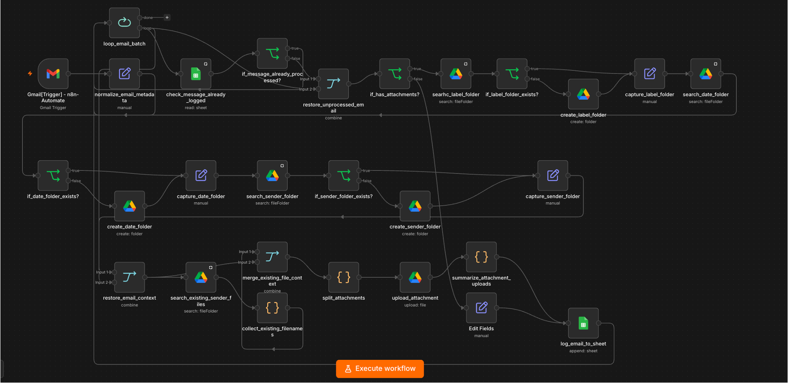
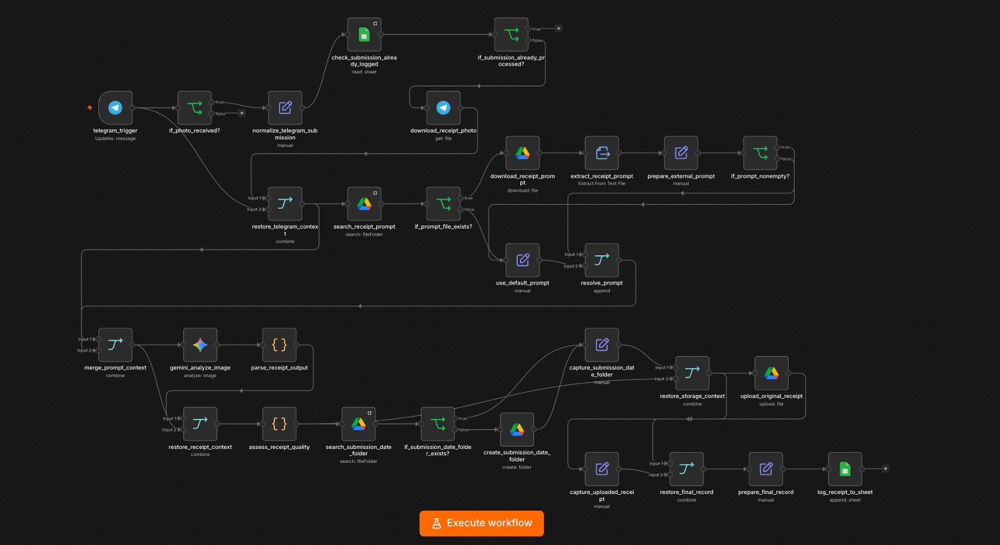
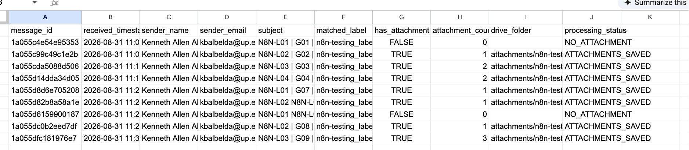
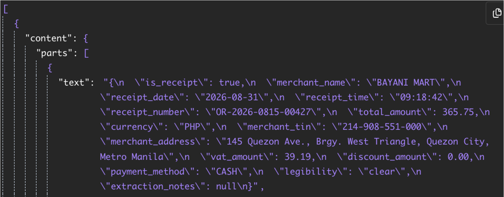
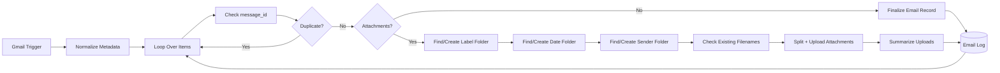
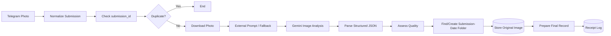

# n8n-Automate

### Workflow Automation for Multi-Label Email Processing and AI-Assisted Receipt Extraction

**n8n-Automate** is a portfolio project containing two production-style automations built in **n8n Cloud**. The first workflow organizes labeled Gmail messages, stores their attachments in structured Google Drive folders, and records email metadata in Google Sheets. The second accepts receipt photos through Telegram, uses **Google Gemini** to extract structured transaction information, archives the original image, and logs the result for review.


## Preview

<table>
  <tr>
    <td width="50%" align="center">
      
      <br>
      <sub><b>Gmail multi-label intake and attachment workflow</b></sub>
    </td>
    <td width="50%" align="center">
      
      <br>
      <sub><b>Telegram + Gemini receipt-processing workflow</b></sub>
    </td>
  </tr>
</table>

<table>
  <tr>
    <td width="50%" align="center">
      
      <br>
      <sub><b>Structured Gmail processing log</b></sub>
    </td>
    <td width="50%" align="center">
      
      <br>
      <sub><b>Gemini extraction from a controlled receipt fixture</b></sub>
    </td>
  </tr>
</table>


## What n8n-Automate Does

### 1. Gmail Multi-Label Automation

The Gmail workflow monitors four configured Gmail labels and processes newly received messages in the background.

- Uses one Gmail Trigger with an OR-style label search.
- Preserves one or several monitored labels attached to a message.
- Serializes trigger batches so several messages returned in one poll are processed individually.
- Uses Gmail `message_id` as the duplicate-processing key.
- Logs messages with and without attachments.
- Supports several attachments in one message while writing only one log row per email.
- Groups files in Google Drive by **matched label → received date → sender**.
- Searches the destination folder before upload and creates `_2`, `_3`, and later suffixes instead of overwriting an existing filename.
- Records the final result in Google Sheets.

Detailed workflow documentation: [`workflows/gmail-multilabel/README.md`](workflows/gmail-multilabel/README.md)

### 2. Telegram Receipt Processing

The Telegram workflow accepts receipt photos and converts them into structured records.

- Receives photos through a Telegram bot.
- Selects the highest-resolution Telegram photo variant.
- Uses `chat_id + message_id` to create a deterministic `submission_id`.
- Checks `submission_id` before running Gemini or uploading another copy.
- Loads an editable extraction prompt from Google Drive with a built-in fallback.
- Uses Google Gemini for multimodal receipt / invoice analysis.
- Parses model output into a fixed JSON schema before operational use.
- Extracts merchant, date/time, receipt number, total, currency, TIN, address, VAT, discount, and payment method when reliably available.
- Assigns `SUCCESS`, `REVIEW_REQUIRED`, or `UNRECOGNIZABLE` based on extraction quality.
- Stores the original image by **Telegram submission date**, even when the image is degraded or unrecognizable.
- Logs the final structured record to Google Sheets.

Detailed workflow documentation: [`workflows/telegram-receipt/README.md`](workflows/telegram-receipt/README.md)

---

## How It Works

### Gmail workflow



Storage convention:

```text
attachments/<matched-label>/<YYYY-MM-DD>/<sender-name>/
```

### Telegram receipt workflow



Storage convention:

```text
receipts/<submission-date>/receipt_<submission_id>.jpg
```

More detailed diagrams are available under [`docs/architecture/`](docs/architecture/).

---

## Test Fixtures

The repository includes controlled examples so the workflows can be understood without using private business data.

```text
examples/
├── gmail/
│   ├── gmail_multiple_label_test_A.docx
│   ├── gmail_multiple_label_test_A.pdf
│   ├── gmail_multiple_label_test_A.png
│   ├── gmail_multiple_label_test_B.docx
│   └── gmail_multiple_label_test_B.png
└── telegram/
    ├── T01.png
    ├── T02.png
    ├── T03.png
    ├── T04.png
    └── T05.png
```

For the Telegram suite, **T01–T04 are controlled synthetic receipt / invoice fixtures** spanning clean to heavily degraded images. **T05 is a handwritten non-receipt input** used to confirm that the workflow can return `UNRECOGNIZABLE` instead of fabricating transaction data.

---

## Validation Summary

| Workflow | Formal cases | Result | Coverage |
|---|---:|---:|---|
| **Gmail Multi-Label** | 9 | **9 / 9 PASS** | No attachment, single/multiple files, four labels, multi-label messages, batch polling, filename collision |
| **Telegram Receipt** | 5 | **5 / 5 PASS** | Clear receipt, alternate invoice layout, partial degradation, heavy degradation, non-receipt input |

Detailed test reports:

- [`docs/testing/gmail-multilabel-testing.md`](docs/testing/gmail-multilabel-testing.md)
- [`docs/testing/telegram-receipt-testing.md`](docs/testing/telegram-receipt-testing.md)
- [`TESTING.md`](TESTING.md)

---

## Technical Stack

| Area | Technologies / Services |
|---|---|
| **Workflow Automation** | n8n Cloud, conditional routing, Loop Over Items, Merge, Edit Fields, Code nodes |
| **Email Automation** | Gmail Trigger, Gmail search / label routing |
| **File Storage** | Google Drive search, folder creation, download, upload |
| **Operational Logging** | Google Sheets lookup and append operations |
| **Messaging** | Telegram Bot / Telegram Trigger |
| **AI / Vision** | Google Gemini multimodal image analysis |
| **Structured Processing** | JavaScript, JSON parsing, deterministic quality rules |
| **Documentation** | Markdown, Mermaid |
| **Testing** | Controlled scheduled-email tests and synthetic receipt-image fixtures |

### Covered Topics

`Workflow Automation` · `n8n` · `Gmail Automation` · `Telegram Bots` · `Google Gemini` · `Multimodal AI` · `Structured AI Output` · `Google Drive` · `Google Sheets` · `Idempotency` · `Batch Processing` · `File Handling` · `Document Extraction` · `Auditability`

---

## Repository Structure

```text
n8n-Automate/
├── workflows/
│   ├── gmail-multilabel/
│   │   ├── gmail-multilabel.json
│   │   └── README.md
│   └── telegram-receipt/
│       ├── telegram-receipt.json
│       └── README.md
│
├── docs/
│   ├── architecture/
│   ├── screenshots/
│   └── testing/
│
├── examples/
│   ├── gmail/
│   └── telegram/
│
├── README.md
├── SETUP.md
├── TESTING.md
└── LICENSE
```

---

## Setup

The exported n8n workflows require the importing user to connect their own credentials and Google resources.

See [`SETUP.md`](SETUP.md) for:

- n8n workflow import;
- Gmail label configuration;
- Google Drive and Google Sheets preparation;
- Telegram bot setup;
- Gemini credentials;
- external receipt prompt configuration; and
- account-specific IDs that must be replaced before use.

n8n workflows are stored and imported as JSON files, and trigger-based workflows must be published before they run automatically.

---

---

## License

This project is released under the **MIT License**. See [`LICENSE`](LICENSE) for details.

---

## Technology & Project Badges

<p align="center">


</p>
