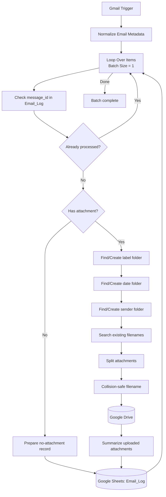

# Gmail Multi-Label Workflow Architecture



## Storage convention

```text
attachments/<matched-label>/<YYYY-MM-DD>/<sender-name>/
```

## Design notes

- Gmail `message_id` is the idempotency key.
- Trigger batches are serialized one email at a time.
- Drive folder find-or-create branches converge through capture/edit nodes.
- Attachment filename comparisons are case-insensitive.
- One email produces one log row even when it contains several attachments.
