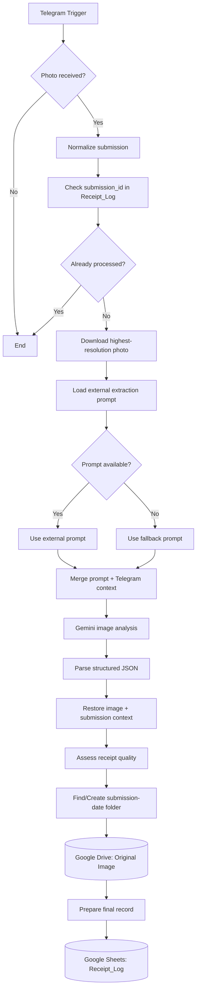

# Telegram Receipt Workflow Architecture



## Core design decisions

### Submission-date storage

Drive grouping is based on the Telegram submission date:

```text
receipts/<submission-date>/receipt_<submission_id>.jpg
```

This is intentionally independent of the transaction date printed on the receipt.

### External prompt with fallback

The Gemini prompt is stored externally for easier editing, while a built-in fallback keeps the workflow operational if the external prompt is unavailable.

### Audit retention

The original Telegram image is uploaded regardless of extraction quality. A degraded or unrecognizable receipt therefore remains available for later human review.

### Idempotency

`submission_id` is used as the duplicate-processing key before Gemini analysis and Drive upload.

### Structured extraction

The AI output is parsed into a fixed schema before writing to the final log, preventing free-form model text from being written directly into the operational record.
